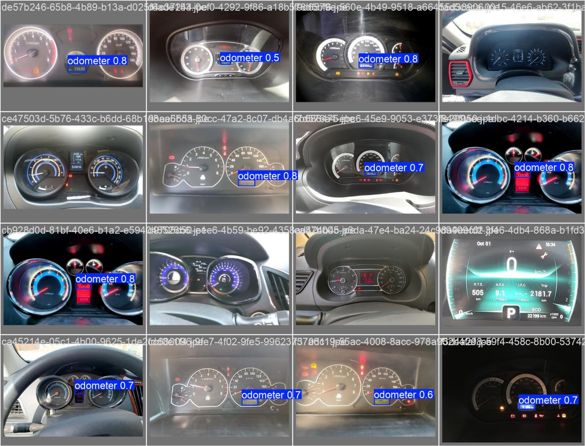

# Odometer-detection
This code would automatically capture your car's mileage based on the given input image of a dashboard.
below you cna see some images that would clarify what I mean :))

The code has been trained on a datast of images to capture the bounding box containing the target value (here the target is car mileae) using Yolo v8, and the test images would be fed into this model and the given bounding box is going to pass through an OCR module to read the numbers.

